# Self-Service Onboarding Quick Guide

## Onboarding Process

The onboarding process consists of the following steps:

1. Register with CSTAR — Create your team's Notify tenant and establish access.
2. Configure your tenant — Connect Notify and configure your team, users and roles.
3. Generate your API key — Generate the API key from Notify Settings for the tenant.
4. Create templates and configure defaults — Set sender information, channels and notification content.
5. Test using the API documentation — Use `/api/docs` to review and test API endpoints.
6. Start sending — Send through your application or directly from the Notify console.

## Step 1: Access CSTAR

1. Go to: https://connect.digital.gov.bc.ca
2. Log in using IDIR.

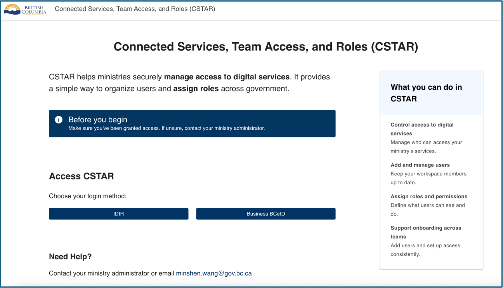

## Step 2: Request Tenant

1. Select **Request a Tenant**.
2. Complete the required details:
   - Tenant name
   - Ministry/Organization
   - Business purpose
3. Submit the request.

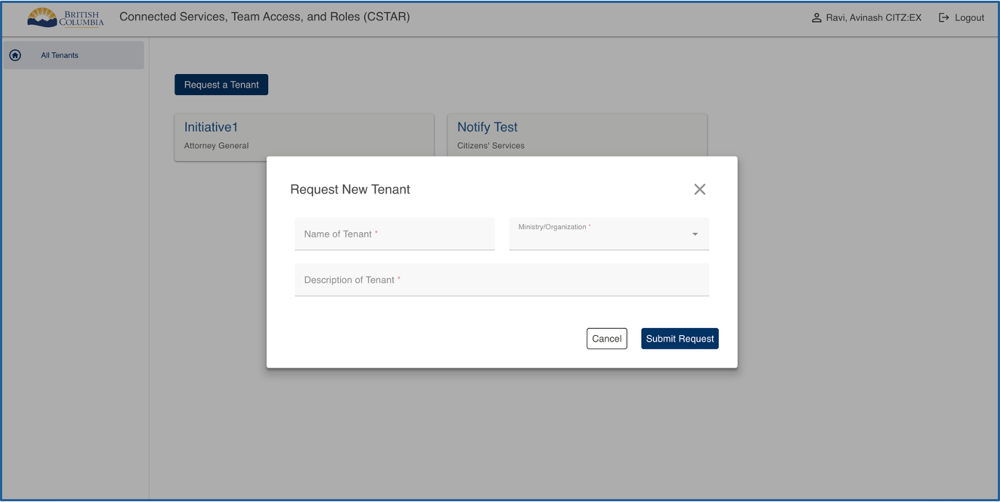

## Step 3: Tenant Creation

1. CSTAR reviews the request.
2. The request goes through a manual approval process and there is a wait until it is approved.
3. Approval results in tenant creation.

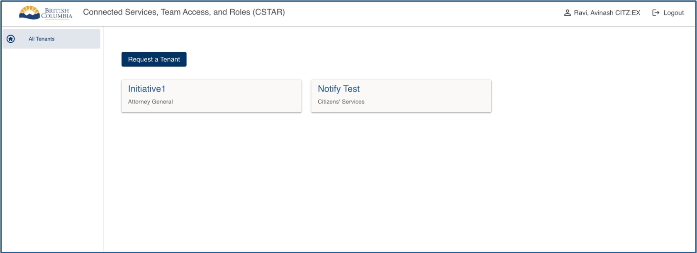

## Step 4: Configure Tenant

1. Add Notify as a connected service.
2. Confirm the tenant linkage.
3. Go to **Connected Services** and click **Add** under the Notify service.
4. At this point, your tenant is set up and linked in CSTAR.

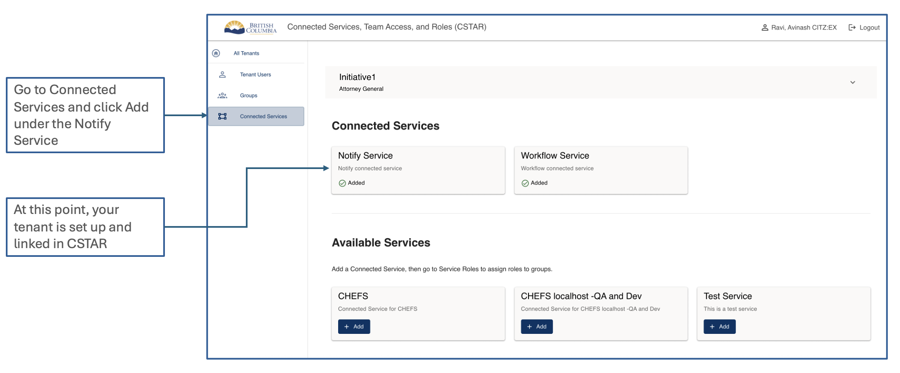

## Step 5: Tenant Access & Roles

The user creating the tenant is granted all three roles:

- **Tenant Owner:** Full access to perform any actions within the tenant.
- **User Admin:** Access to create and manage users and groups.
- **Service User:** Read-only access.

To add users, click **Add another user to this tenant**. All users created in the tenant will be displayed.

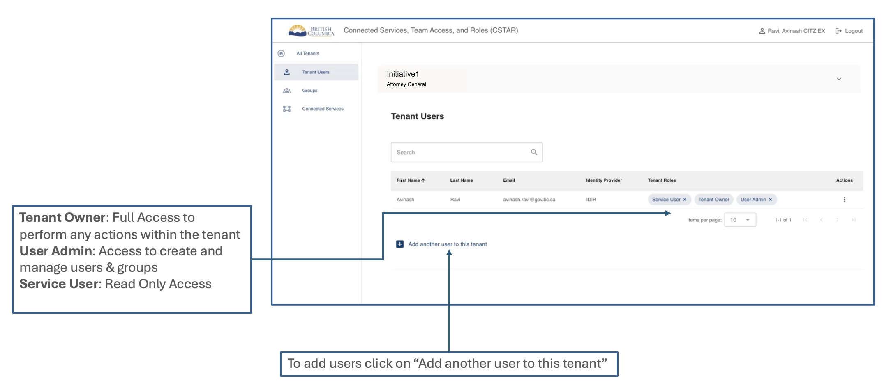

## Step 6: Adding Users to a Tenant

1. Search by first name, last name or email.
2. Search results are displayed. Select the user to be added.
3. Select any or all of the available roles to be assigned to the user.
4. Assign group(s) to the user if a group is available.
5. If there is no group, groups can be created under the **Groups** section.

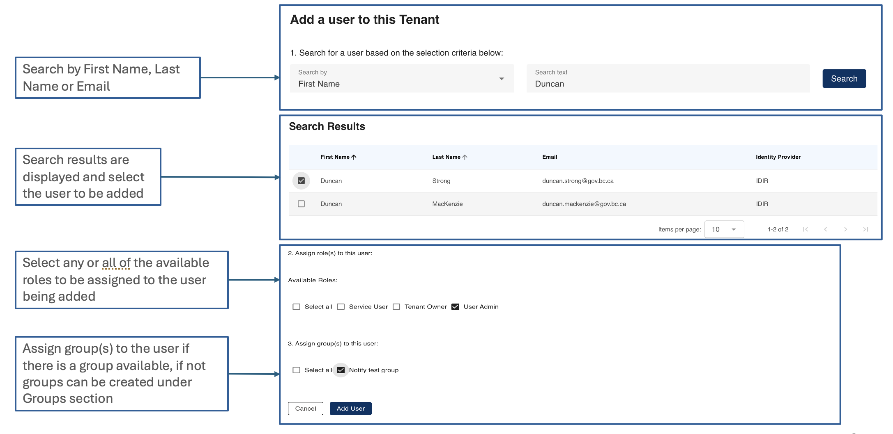

## Step 7: Create a Group and Assign Users

1. Select **Groups**.
2. Click **Create Group**.
3. Fill in the group name and description.
4. Click **Submit**.
5. You can choose the option to add yourself as a user to the group.

Create groups that align with your team structure.

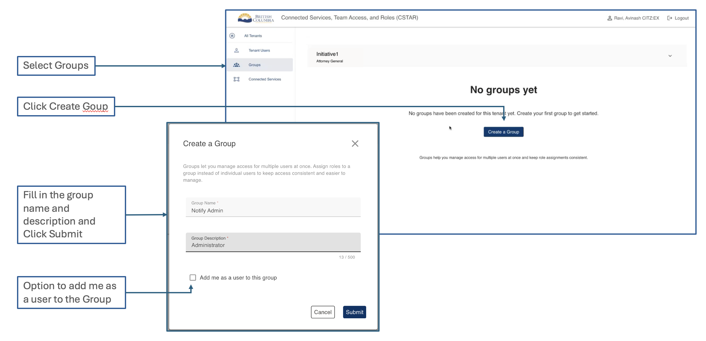

## Step 8: Create a Group and Assign Users

1. Select the group.
2. Members assigned to the group are displayed.
3. Add more members to the group as required.

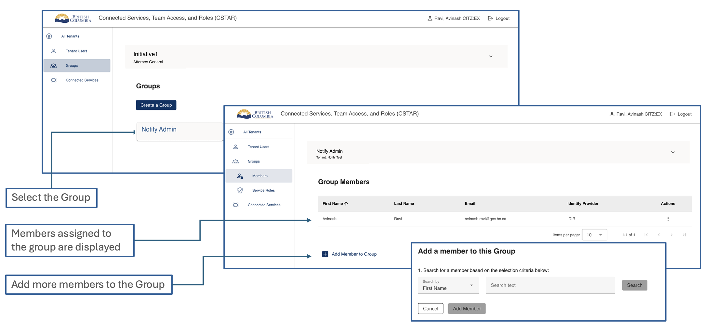

## Step 9: Assign Notify Roles to Groups

Within each group, assign the appropriate Notify role(s).

1. Go to **Service Roles**.
2. Click **Edit**.
3. Assign the roles.
4. Select **Save Changes**.

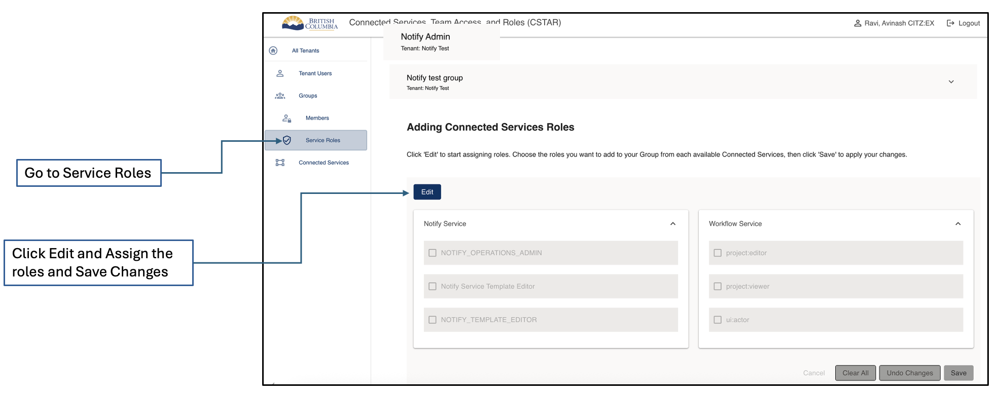

### Notify Operations Admin

- Configure notification limits/thresholds.
- Manage operational settings.

### Notify Template Editor

- Create templates.
- Edit/update templates.

### Notify Viewer

- View templates.
- View notification history/logs.

## Log into Notify

1. Go to Notify:
   - Production: https://notify.digital.gov.bc.ca/
   - Test: https://common-notify-test.apps.silver.devops.gov.bc.ca/
2. Sign in with IDIR.
3. Select your tenant.
4. Confirm that the correct tenant is displayed.

> **Note:** If your tenant does not appear, or you receive an authorization message, verify your CSTAR tenant membership and Notify role assignment.

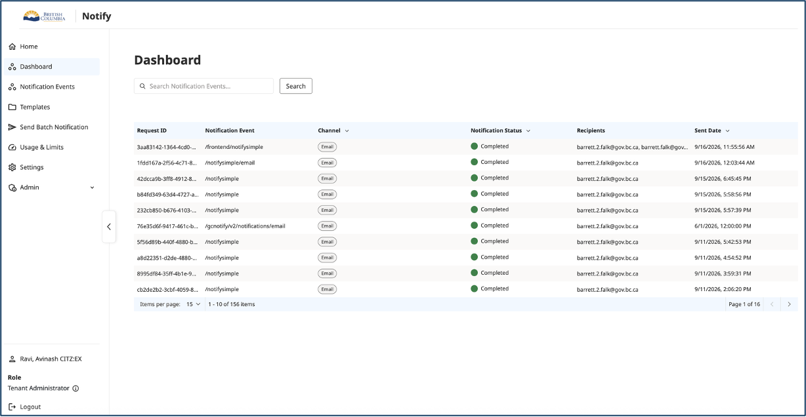

## Send Batch Notification

1. Navigate to **Send Batch Notification**.
2. Select a notification channel.
3. Select a template from the drop-down. A preview of the template will be displayed.

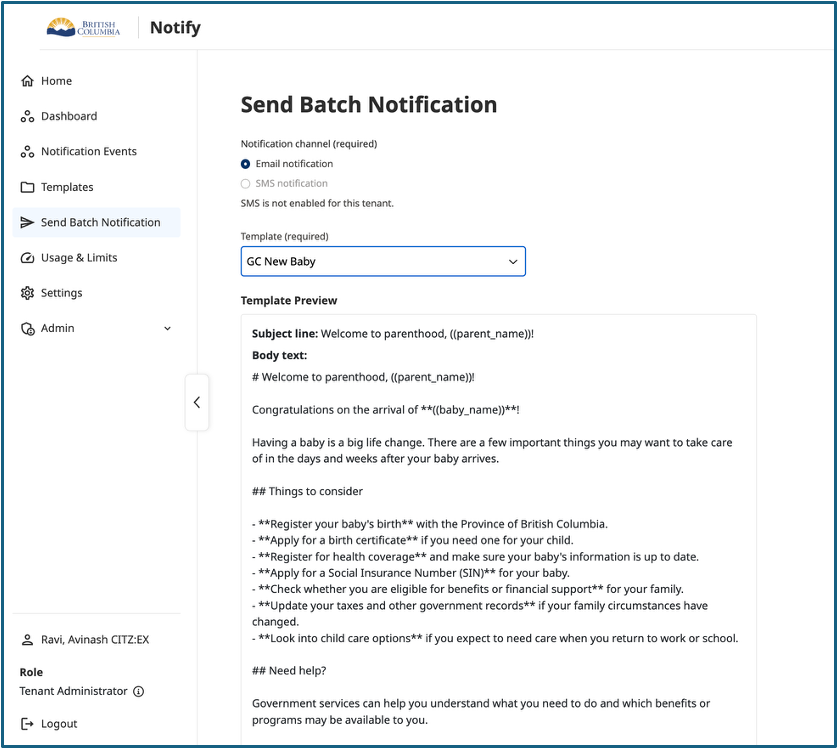

4. Download the sample CSV file to see the required columns based on the template placeholders.
5. Add recipient information in the CSV file and upload the completed file.
6. Once uploaded, the recipient data will be populated into the template.

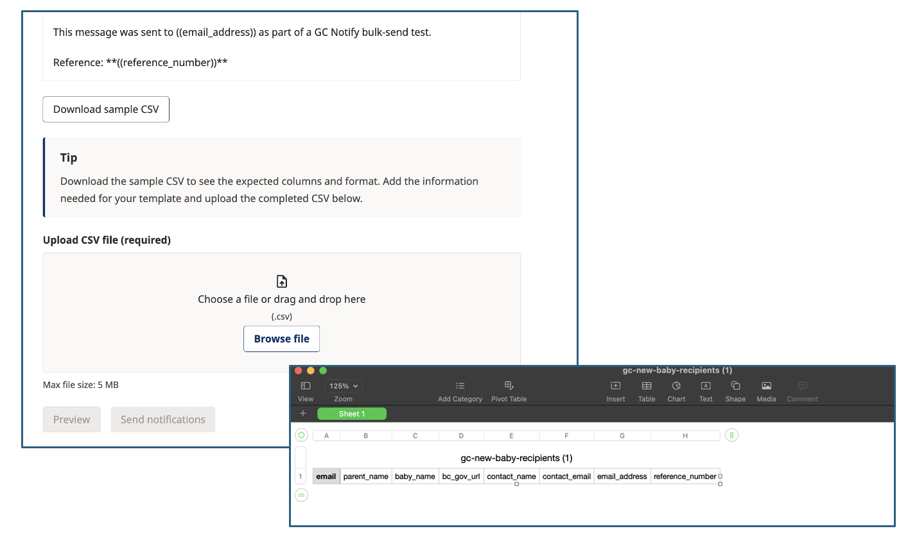

## Generate your Notify API Key

1. Open your Notify tenant.
2. Go to **Settings**.
3. Locate the API key section.
4. Generate your API key.
5. Copy and securely store the key.
6. Use this key when your application calls the Notify API.
7. Treat your API key as a secret. Do not share it in source code repositories, screenshots, documentation, email or chat.

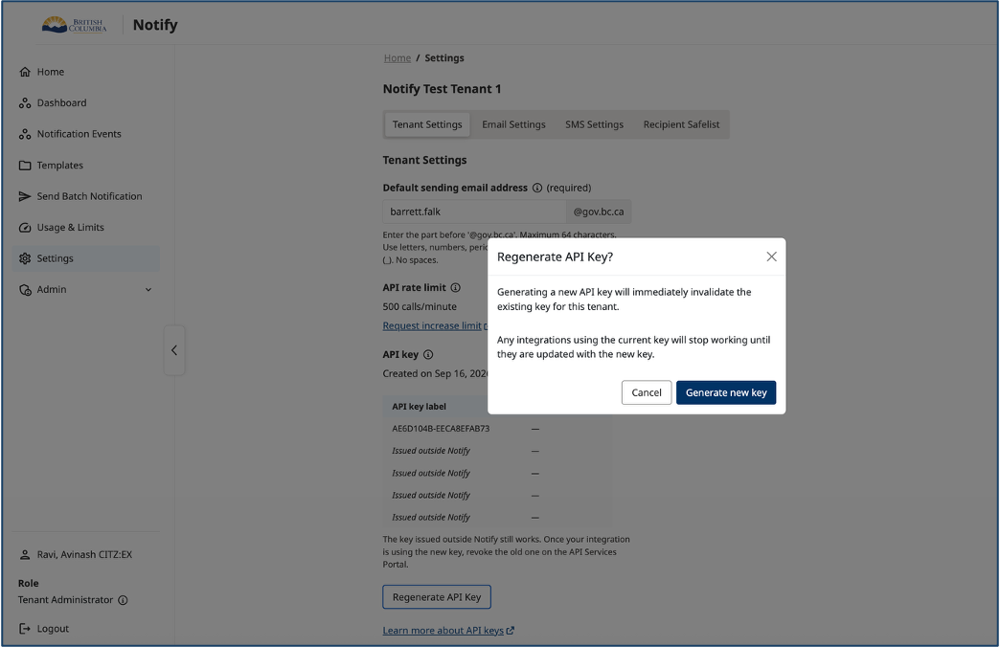

## API Documentation

Point your developers at the documentation before you commit to anything.

API documentation: https://notify.digital.gov.bc.ca/api/docs

The documentation provides:

- Current API endpoints
- Request parameters
- Request/response examples
- Authentication information
- Example payloads
- Try it out functionality
- Ability to execute requests directly against the API

## Swagger: Authorize

1. Open `/api/docs`.
2. Select **Authorize**.
3. Enter your API key using the authentication format shown by the documentation.
4. Apply/authorize.
5. Expand the endpoint you want to test.

There are two authentication formats:

1. Notify API endpoints
2. GC Notify compatibility endpoints

The GC Notify routes use a special legacy API-key header format, while the normal Notify endpoints use the standard Notify authentication.

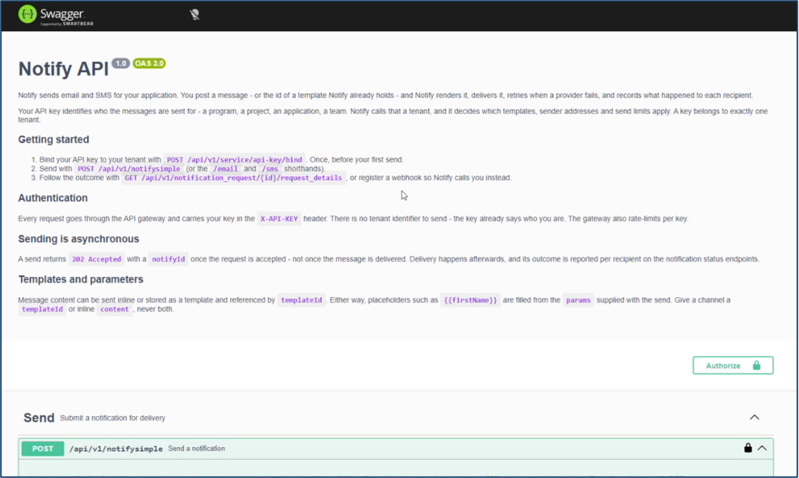

## Swagger: Try it out

1. Expand the endpoint.
2. Select **Try it out**.
3. Review the example request.
4. Replace the example values with your test values.
5. Select **Execute**.
6. Review the HTTP response.

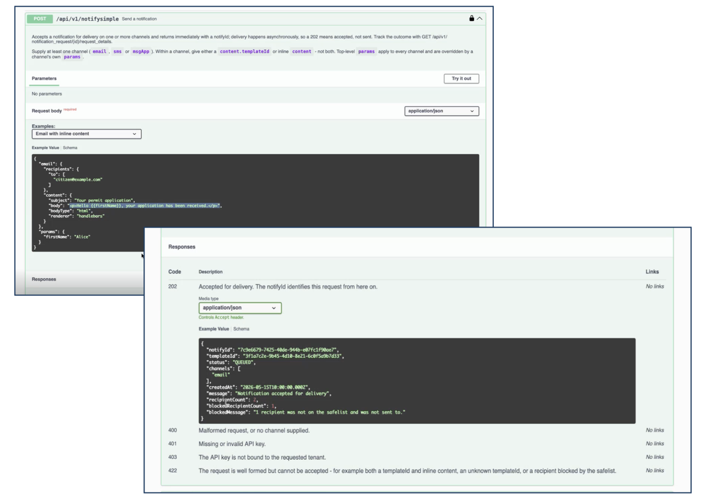

## Start Sending Notifications

